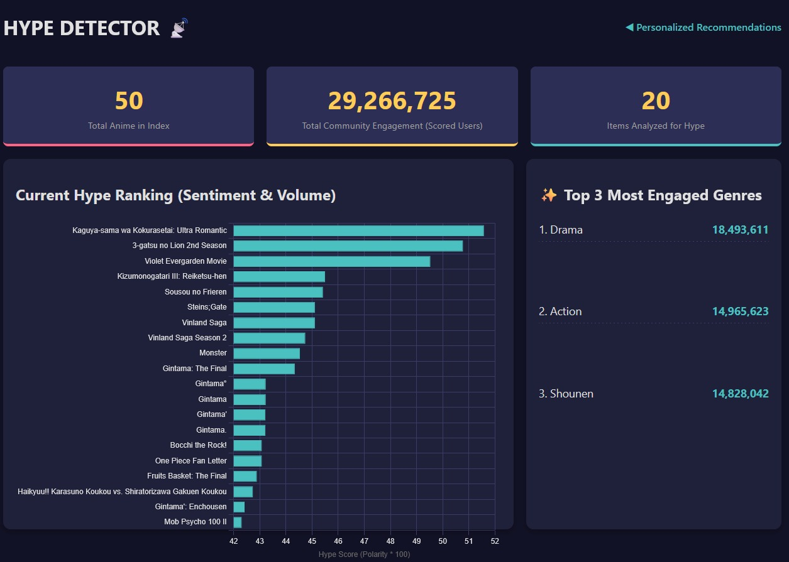
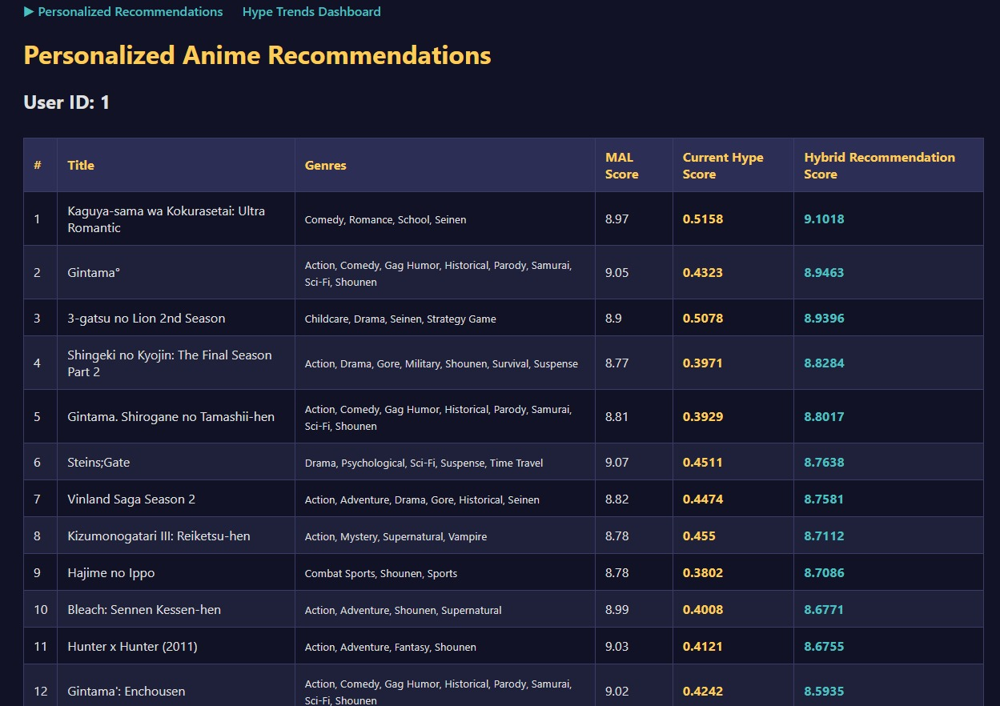

<h1 align="center">Predictive Anime Recommender with Hype Detection: HypeBlend</h1>

<p align="center">
  <!-- Technology Badges -->
  
  
  
  
  
  
  
  
  
  
  
  
  
  
</p>

***

## Table of Contents

1. [About the Project](#about-the-project)
2. [Features](#features)
3. [Project Structure](#project-structure)
4. [Technologies Used](#technologies-used)
5. [Setup and Installation](#setup-and-installation)
6. [Usage](#usage)
7. [Output Screenshots](#output-screenshots)
8. [License](#license)

***

## About the Project

This project implements a unique **Hybrid Recommendation Engine** designed to solve the "cold start" and "discovery" problems in media recommendation. The system provides:

- **Personalization:** Based on user history (Collaborative Filtering).
- **Trend-Awareness:** Boosted by real-time community sentiment and discussion volume ("Hype Score").

The data pipeline runs on Python, the model is served by a lightweight Flask API, and the results are presented in a high-contrast, dark-mode dashboard styled for impact and ease of use.

## Features

- **Hybrid Engine:** Uses **SVD (Surprise)** for collaborative filtering, dynamically adjusted by the real-time Hype Score.
- **Hype Detector:** Collects commentary from **Reddit API (PRAW)** and uses **TextBlob** sentiment analysis to quantify current trends.
- **Interactive Dashboard:** Attractive frontend using **Chart.js** for displaying key metrics and Hype Ranking.
- **Secure Configuration:** Utilizes **python-dotenv** and `.gitignore` to secure API keys and suppress sensitive data.

## Project Structure

Standard Flask/ML directory separation for data, models, and logic.

```
.
├── data/
├── models/
├── src/
│   ├── api_collector.py
│   ├── data_processing.py
│   ├── hype_detector.py
│   └── recommender_model.py
├── templates/
│   ├── index.html
│   └── trends.html
├── venv/           # (ignored)
├── .env            # (ignored)
├── app.py
└── requirements.txt
```

## Technologies Used

| Category         | Library              | Purpose                                                    |
|:-----------------|:---------------------|------------------------------------------------------------|
| **Backend/Web**  | Python (3.9+)        | Core programming language                                  |
|                  | Flask                | Lightweight framework for API and web pages                |
| **ML/Data Core** | Pandas               | Efficient data manipulation                                |
|                  | NumPy (<2.0)         | Fundamental numerical operations                           |
|                  | scikit-learn         | Standard ML structure/metrics                              |
|                  | Surprise             | Collaborative Filtering (SVD)                              |
| **Data/NLP**     | requests             | HTTP requests for Jikan API                                |
|                  | PRAW                 | Python Reddit API Wrapper                                  |
|                  | TextBlob             | Sentiment analysis for social comments                     |
| **Utilities**    | joblib               | Efficient serialization for ML assets                      |
|                  | python-dotenv        | Secure secret management                                   |
| **Frontend/Viz** | Matplotlib/Seaborn   | Data analysis/debugging                                    |
|                  | Chart.js             | Dynamic charting dashboard                                 |

### APIs Used

- **Jikan API (v4)**: Fetches official anime metadata (scores, genres, titles).
- **Reddit API**: Accessed via PRAW for real-time community sentiment and volume.

## Setup and Installation

### Prerequisites

- Python 3.9+
- Reddit API Credentials (for `.env`)

### Installation Steps

1. **Clone the Repo:**
   ```bash
   git clone YOUR_REPO_URL
   cd predictive-recommender
   ```
2. **Create and Activate Environment:**
   ```bash
   python -m venv venv
   .\venv\Scripts\activate  # Windows
   # source venv/bin/activate  # Linux/macOS
   ```
3. **Install Dependencies:**
   ```bash
   pip install -r requirements.txt
   ```
4. **Configure Secrets:** Create a `.env` file in the project root with your API keys.

### Run Data Pipeline

Execute these scripts sequentially to prepare all data and models:

```bash
python src/api_collector.py
python src/data_processing.py
python src/hype_detector.py
python src/recommender_model.py
```

## Usage

### Starting the Flask Application

```bash
python app.py
```

### Accessing the Frontend

Server runs at `http://127.0.0.1:5000/`.

- **Recommendations:** `http://127.0.0.1:5000/`
- **Hype Trends Dashboard:** `http://127.0.0.1:5000/trends`

## Output Screenshots

### Hype Trends Dashboard

A view of the dynamic dashboard showing the Hype Score ranking and key metrics.

<p align="center">
  
</p>

Hybrid scores for a specific user.

<p align="center">
  
</p>

## License

This project is licensed under the MIT License.

***

<!-- FOOTER: Author & LinkedIn -->

<p align="center">
  <b>Luana K. Ribeiro</b><br>
  <a href="https://www.linkedin.com/in/ataidekaroline/" target="_blank">
    
  </a>
</p>


